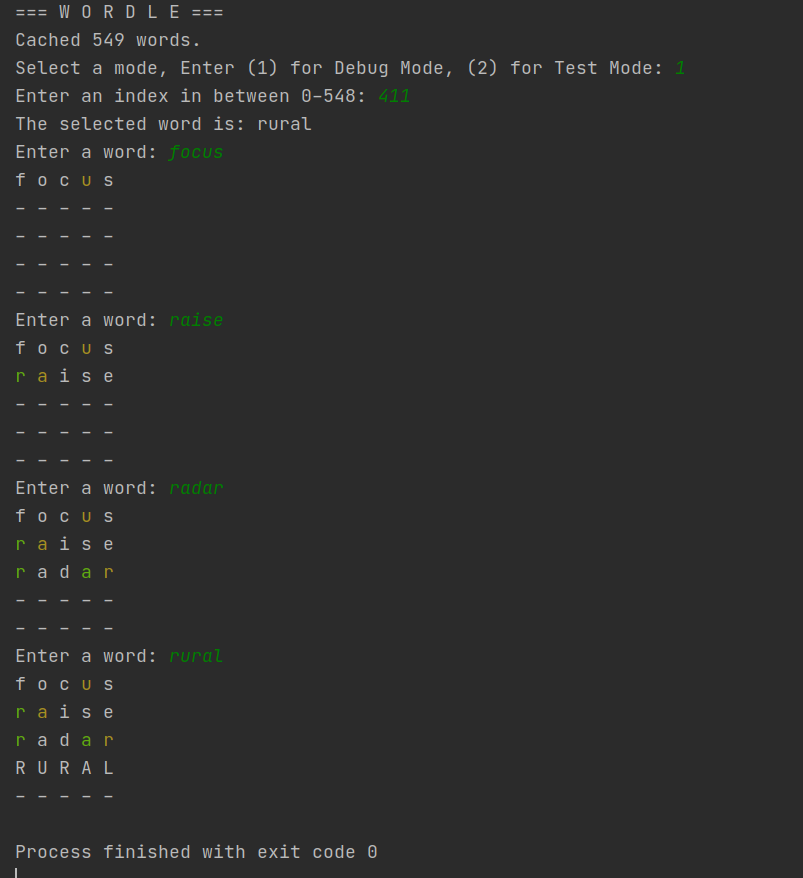

# PS2: Wordle
## Deadline: April, 3th at 23:00
## Important Note: 
This is an individual assignment, not a group work. You can discuss with each other but you are supposed to work on the code on your own.
## Introduction

In this problem set, you will implement **WORDLE**, an online word-puzzle game that is becoming popular. You can play the game from  [this link](https://www.nytimes.com/games/wordle/index.html) to learn the logic, it is fun! Here we have summarize the game rules for you:


* First, we will randomly select a 5-letter word from the English Dictionary.
* The user has five trials to guess the word correctly. 
* With each guess, if the user guesses the exact position of a letter in the word, it will turn GREEN.
* If the user guesses a letter that exists in the word of the day, but it is in the wrong position, it turns YELLOW. 
* If the letter does not exist, it will stay gray.

We will implement a replica version of the game in this PS. We provide some example test cases whose results will appear on GitHub actions after you commit your work. Note that **there will be additional test cases** that we will use when grading your solutions, so the points you see when you commit will not be your final grade, as we did in PS1.

You will code your answer main.py. 

---
## Parts
1. Game Init Screen
2. Guess Check
3. The Game
---

## Part I: Game Init Screen (20 pts)

In this part, you will be designing the game screen. First, we will print a title with the number of words to guess in total. This part is already provided for you. In our initial example, there are 549 words in our word list.

You will have two modes: debug mode and test mode. In the debug mode, you will give an integer index to pick a selected word at the beginning of the game and print it; in the test mode, the game autonomously select a word and hide this info. Then, you should print slots for each guess; we are allowing five guesses for this version.

You are given two word lists: `guess_word_list` and `valid_word_list`. As the naming indicates, the `guess_word_list` includes candidate words for the game, and the `valid_word_list` includes all of the words that will be accepted as the input. You will be using a Python package for selecting a word, called `random`. You will draw a random integer between (0,549-1) to choose a word index to read from the `guess_word_list`. For a designated output, please see the output below.

Hint: Please check random.randint() function's documentation to choose a random word.

Sample I/O:
```
=== W O R D L E ===
Cached 549 words.
Select a mode, Enter (1) for Debug Mode, (2) for Test Mode: 1
Enter an index in between 0-548: 411
The selected word is: rural


=== W O R D L E ===
Cached 549 words.
Select a mode, Enter (1) for Debug Mode, (2) for Test Mode: 1
Enter an index in between 0-548: 241
The selected word is: fifth


=== W O R D L E ===
Cached 549 words.
Select a mode, Enter (1) for Debug Mode, (2) for Test Mode: 1
Enter an index in between 0-548: 150
The selected word is: bring

=== W O R D L E ===
Cached 549 words.
Select a mode, Enter (1) for Debug Mode, (2) for Test Mode: 2
The selected word is: catch

```

### Some Notes on the Random Package

For the test mode, you will need a **package** to generate random numbers. **Packages** are useful when you would like to use essential functionality by importing it. In our case, you will use the **random package** for generating random integers in Python. First, please check the reference: https://docs.python.org/3/library/random.html

Sepcifically, we will be using `randint()` function of the random module to generate random integers. 
For an example usage:

```
# first, import the package to be able to use it
import random 

# then, generate a random integer between 0 and 10 (both ends are included)
r1 = random.randint(0, 10)
```

## Part II: Guess Check (20 pts)

For each game step, your program should check the input guessed word. You will take input as follows:

```
=== W O R D L E ===
Cached 549 words.
Select a mode, Enter (1) for Debug Mode, (2) for Test Mode: 1
Enter an index in between 0-548: 411
The selected word is: rural
Enter a word:
```

There are two limitations:
* The length of the guessed word should be 5,
* The guessed word should be in the word list.

For each limitation case, you need to print the following outputs:
* Word length should be 5.
* Word <guessed_word> is not found in the list.

Sample outputs:
```
Enter a word: hear
Word length should be 5.
```

```
Enter a word: aaaaa
Word aaaaa is not found in the list.
```

To implement this functionality, implement a function `is_valid(word)`, which takes the guessed word as input, and returns `True` if both conditions are satisfied, otherwise returns `False`.

Note: After we check whether a word is valid or not, the program will continue to ask a new word and there is no deduction applied to the number of guesses.

## Part III: The Game (60 pts)

After the limitations part is done, you can proceed with completing the game logic. First, take a look at the screenshot below:



* As we see from the example, we are in the debug mode, and we see the target word as **rural.** Initially, all the slots are empty.
* After we make our first guess, the color of the letter 'u' is yellow since that letter exists in the target word, but it is in the wrong position. 
* In the second guess, we found the letter 'r' in the correct position; it is green. As in the previous step, the letter 'a' becomes yellow since it exists in the target word but is in the wrong position.
* In the third guess, we guessed a more similar word, "radar". Here, second letter "a" is in the target word, but it is not colored since there is only one a and we found its correct position. Similarly, the last letter 'r' becomes yellow since it exists in the target word and appears more than once.
* In the last part, we found the target word "RURAL". All the letters become capitalized, no coloring is required.

Your code should follow this logic. To implement the coloring, there is a trick you can do. In Python, if you place:

* `print(f"\033[92m{letter}\033[0m")` => prints the variable 'letter' as green
* `print(f"\033[33m{letter}\033[0m")` => prints the variable 'yellow' as green

The game ends in two conditions:

* after the player found the correct word
* or there are no remaining attempts left.